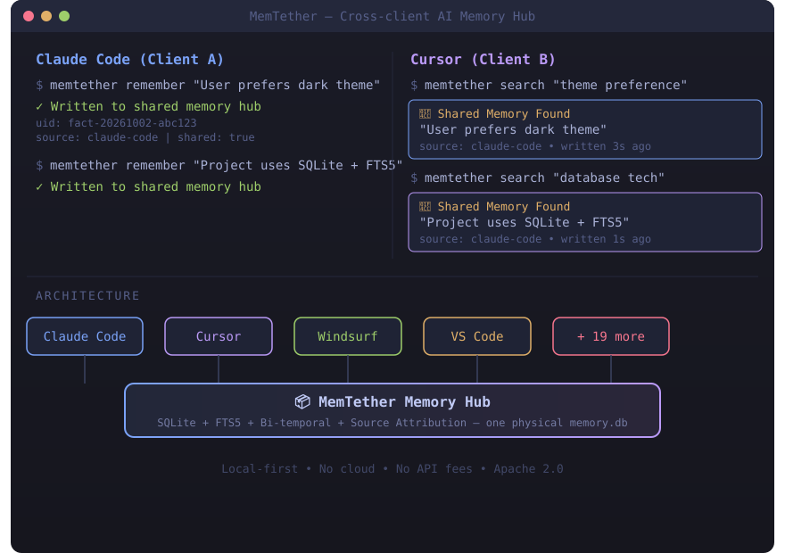

<div align="center">




# Your AI agents can now share memories.

**Local-first · No cloud · No API fees · One physical memory.db shared by 23+ clients**

[](https://pypi.org/project/memtether/)
[](https://pypi.org/project/memtether/)
[](https://github.com/MemTether/MemTether/actions/workflows/ci.yml)
[](LICENSE)
[](https://github.com/MemTether/MemTether/stargazers)

[Quick Start](#quick-start) · [Why MemTether](#why-memtether) · [Architecture](#architecture) · [Benchmarks](#benchmarks) · [Connect Clients](#connect-your-clients) · [中文说明](README.zh-CN.md)

</div>

---

## Quick Start

```bash
# 1. Install
pip install memtether

# 2. Initialize (creates demo memory DB)
python -m memtether init

# 3. Connect all detected AI clients (Claude, Cursor, Windsurf, VS Code, etc.)
python -m memtether connect --all
```

That's it. Your AI agents now share one physical memory database.

```bash
# Try it:
python -m memtether search "hello"
python -m memtether remember "my first shared memory"
python -m memtether stats
```

---

## Why MemTether

| | MemTether | mem0 | cognee | zep |
|---|---|---|---|---|
| **Local-first** | ✅ | ❌ cloud | ✅ | ❌ cloud |
| **Cross-client shared memory** | ✅ 23 adapters | ❌ | ❌ | ❌ |
| **Source attribution** | ✅ | ❌ | ❌ | ✅ |
| **Bi-temporal (T + T′)** | ✅ | ❌ | ❌ | ✅ |
| **Q-Value usage ranking** | ✅ | ❌ | ❌ | ❌ |
| **Supersession (never delete)** | ✅ | ❌ | ❌ | ✅ |
| **4-factor re-ranking** | ✅ | ❌ | ❌ | ❌ |
| **Deterministic scaffolds** | ✅ | ❌ | ❌ | ❌ |
| **MCP server** | ✅ | ✅ | ✅ | ✅ |
| **Eval suite included** | ✅ | ✅ | ❌ | ❌ |
| **No API key needed** | ✅ | ❌ | ❌ | ❌ |

<details>
<summary>📋 Full feature list</summary>

- **Cross-client shared memory** — 23 client adapters (Claude Code, Cursor, Windsurf, VS Code, Zed, JetBrains, and more) all read/write the same physical `memory.db` via file-level pointers (junction/symlink)
- **Source attribution** — every memory knows which client wrote it, preventing cross-client attribution pollution
- **Bi-temporal** — two time axes: T (when the fact was true in the real world) and T′ (when the system recorded it), enabling "what did we know at time X?" queries
- **Supersession** — old memories are never deleted; they are superseded by newer versions with full audit trail
- **Q-Value** — usage-based ranking factor: memories that are actually retrieved and used rank higher over time
- **4-factor re-ranking** — semantic similarity + recency + frequency (MemX Eq.3) + importance type weight, blended with RRF
- **Deterministic scaffolds** — for counting/temporal/comparison/aggregation queries, builds a structured scaffold and prepends it to the top result
- **Consolidation index** — 2708 topics + 315 chains + 37 standing instructions, injected as bonus recall path
- **FTS5 triggers** — SQLite-level full-text sync (INSERT/DELETE/UPDATE triggers), eliminating Python-side `except:pass`
- **Hubguard** — cross-process concurrent write lock + atomic write + format fallback detection
- **Conflict detection** — 89 quantified conflict patterns, 5 detection modes
- **LLM auto-extraction** — extract structured memories from conversation text

</details>

---

## Architecture

```
┌─────────┐   ┌─────────┐   ┌─────────┐   ┌─────────┐
│  Claude │   │ Cursor  │   │Windsurf │   │ VS Code │   ... 23 adapters
│  Code   │   │         │   │         │   │         │
└────┬────┘   └────┬────┘   └────┬────┘   └────┬────┘
     │              │              │              │
     └──────────────┴──────┬───────┴──────────────┘
                           │
                    ┌──────▼──────┐
                    │  MemTether  │
                    │ Memory Hub  │
                    │             │
                    │ SQLite      │  ← one physical memory.db
                    │ FTS5        │  ← full-text search (triggers)
                    │ ChromaDB    │  ← vector search (bge-m3, 1024-dim)
                    │ Bi-temporal │  ← T + T′ dual time axes
                    │ Q-Value     │  ← usage-based ranking
                    │ Hubguard    │  ← concurrent write lock
                    └─────────────┘
```

<details>
<summary>🔧 Tech stack details</summary>

| Component | Technology | Purpose |
|---|---|---|
| Database | SQLite (WAL mode) | Single-file, zero-config, cross-platform |
| Full-text | FTS5 trigram + triggers | O(1) BM25 search, SQL-level sync |
| Vector | ChromaDB + bge-m3 (1024-dim) | Semantic search, local embedding |
| Fusion | Reciprocal Rank Fusion (K=60) | Merge multi-path results |
| Re-ranking | 4-factor (sem 0.45 + rec 0.25 + freq 0.05 + imp 0.10) | Z-score + sigmoid normalization |
| Governance | Supersession + bi-temporal + conflict detection | Never delete, always traceable |
| Concurrency | Hubguard (file lock + atomic write) | Cross-process safe |
| API | FastAPI REST + MCP server | Any client can connect |
| Packaging | PyPI + Docker | pip install memtether |

</details>

---

## Connect Your Clients

```bash
# Auto-detect and connect all installed AI clients
python -m memtether connect --all

# Or connect specific clients
python -m memtether connect claude-code
python -m memtether connect cursor
python -m memtether connect windsurf

# Verify connections
python -m memtether verify
```

Supported clients (23 adapters): Claude Code, Cursor, Windsurf, VS Code, Zed, JetBrains, Cline, Roo Code, Kilo Code, Continue, Cody, Amazon Q, Gemini CLI, Neovim, Claude Desktop, Codex, WorkBuddy (CN + Intl), CodeBuddy, ZCode, DSH, OpenClaw, and more.

---

## Memory Operations

```bash
# Write a memory
python -m memtether remember "User prefers dark theme and uses Vim keybindings"

# Search memories
python -m memtether search "theme preference"

# Search with type filter
python -m memtether search "database" --type fact

# Correct (supersede) a memory
python -m memtether correct <uid> "User now prefers light theme"

# Retire a memory
python -m memtether retire <uid> "No longer relevant"

# View all memories
python -m memtether stats

# As-of query: "what did we know on 2026-09-15?"
python -m memtether as-of 2026-09-15
```

---

## Benchmarks

### LongMemEval (500 questions, full run)

| Metric | Score | Notes |
|---|---|---|
| **Strict match (global)** | 62.6% | 209/334 applicable (166 prose-type excluded) |
| **LLM judge (global)** | 54.6% | 263/482 (18 generation failures) |
| **Multi-session strict** | 48.8% | 65/133 — above industry avg 27.9% |
| **Multi-session LLM judge** | 60.0% | 80/133 |
| **E-Hybrid (session summary)** | 73.3% | 11/15 (small sample) |

<details>
<summary>Per-type breakdown (500Q, 2026-10-02)</summary>

| Type | n | Strict | LLM Judge |
|---|---|---|---|
| knowledge-update | 78 | 76.6% | 64.4% |
| multi-session | 133 | 48.8% | 58.4% |
| single-session-assistant | 56 | 40.4% | 42.9% |
| single-session-preference | 30 | N/A | 33.3% |
| single-session-user | 70 | 86.4% | 80.0% |
| temporal-reasoning | 133 | 60.7% | 41.4% |

</details>

> ⚠️ Results use our own harness (retrieval → generation → judge), not directly comparable with mem0's reported 94.4%.

---

## How It Works

<details>
<summary>📖 Memory lifecycle</summary>

1. **Write**: Any connected client calls `remember()` → gateway validates source → SQLite INSERT (triggers auto-sync FTS) → ChromaDB vector upsert
2. **Search**: `search_hybrid()` runs 4 recall paths in parallel (vector + FTS5 BM25 + literal + entity graph) → RRF fusion → 4-factor re-ranking → TTL expiry check → self-reference suppression → dedup → scaffold injection
3. **Update**: `correct()` marks old as superseded → creates new fact with full audit trail → FTS triggers auto-sync
4. **Retire**: `retire()` marks as retired → FTS trigger removes from index → vector deleted
5. **Project**: `rebuild()` generates MEMORY.md projection (3980 char budget) → injected into each client's context window

</details>

<details>
<summary>🏗️ Bi-temporal model</summary>

Two time axes:
- **T (valid time)**: when the fact was true in the real world
- **T′ (recorded time)**: when the system learned about it

Example: "API key expired on 2026-09-15" — the key actually expired on 09-15 (T), but the system only found out on 09-16 (T′). Querying as-of 09-15 12:00 with kind='known' returns "still valid" (which is what the system believed at that moment), while kind='valid' returns "expired" (reality).

This distinction prevents retroactive truth bias: you can reconstruct what the system knew at any point in time.

</details>

---

## Install from Source

```bash
git clone https://github.com/MemTether/MemTether.git
cd MemTether
pip install -e .
```

## Docker

```bash
docker build -t memtether .
docker run -p 8420:8420 -v ./data:/app/data memtether
```

---

## License

Apache 2.0 — see [LICENSE](LICENSE)

## Contributing

Issues and PRs welcome. See [CONTRIBUTING.md](CONTRIBUTING.md) for guidelines.
