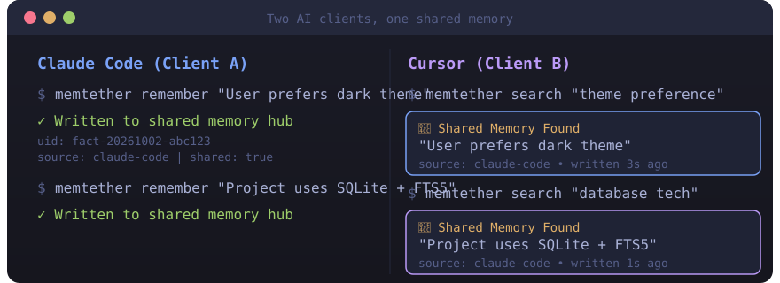
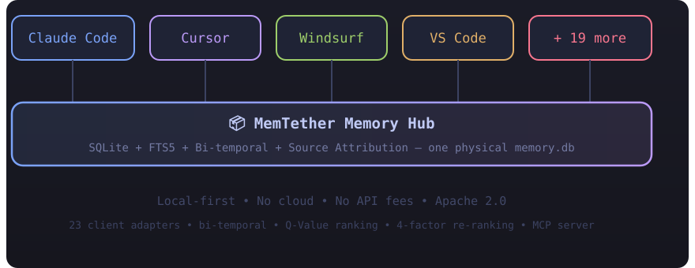

# MemTether — 跨客户端 AI 记忆中枢

mcp-name: io.github.lanbass869-cell/memtether

<div align="center">

**让多个 AI 客户端共享同一份物理记忆**

**本地优先 · 零云服务 · 零 API 费用 · 一个物理 memory.db 被 23+ 客户端共享**

[](https://pypi.org/project/memtether/)
[](https://pypi.org/project/memtether/)
[](https://github.com/MemTether/MemTether/actions/workflows/ci.yml)
[](LICENSE)
[](https://registry.modelcontextprotocol.io)

[English README](README.md) | [快速开始](#快速开始) | [架构](#架构) | [评测](#评测) | [已知限制](#已知限制)

</div>

---

## 这是什么

你用 Claude Code 写代码、Cursor 做重构、Windsurf 做探索——每个工具有自己的记忆。切换工具，你的 AI 就忘了所有事。

**MemTether 的解法比你想的更简单：让它们都指向同一个文件。**

不是一个 API 服务，不是一个云平台，不是一个新框架。就是一个 SQLite 文件，通过文件级指针（junction/symlink）被 23 个客户端共享。

<div align="center">

</div>

## 快速开始

```bash
# 1. 安装
pip install memtether

# 2. 初始化（创建演示记忆库）
memtether init

# 3. 接入所有已检测到的 AI 客户端
memtether connect --all
```

试试：

```bash
memtether search "shared memory"
memtether remember "我的第一条共享记忆"
memtether stats
```

Windows 用户可以双击 `install.bat` 一键完成。

<details>
<summary>更多安装方式</summary>

```bash
# 从源码安装
git clone https://github.com/MemTether/MemTether.git && cd MemTether && pip install -e .

# 语义检索（本地 embedding，不需要云端）
pip install "memtether[vector]"

# REST API 服务端
pip install "memtether[server]"

# Docker
docker build -t memtether . && docker run -p 8420:8420 -v ./data:/app/data memtether
docker-compose up
```

不安装也能体验：

```bash
python scripts/make_demo_db.py
MEM_DB=~/.memtether/demo.db python mem.py search "跨客户端共享"
```

</details>

---

## 为什么不是"又一个记忆库"

| 常见做法 | 问题 | MemTether 的做法 |
|---|---|---|
| 每个客户端自己存记忆 | 切换工具就丢上下文 | **文件级指针**：所有客户端读写同一个 `memory.db` |
| 云端托管记忆（mem0 cloud, zep cloud） | 隐私 + API 费用 + 宕机 | **本地优先**：SQLite 在你机器上，零云端依赖 |
| 删除旧记忆 | 无法追溯"当时知道什么" | **Supersession**：旧记忆标记，永不删除 |
| 单一时间轴 | 无法区分"何时为真"与"何时得知" | **双时间轴**：T + T′ 双轴，支持 as-of 查询 |
| 所有记忆平权 | 真正有用的记忆被埋没 | **Q-Value**：被检索并采纳的记忆排名上升 |
| 单路搜索（只有向量） | 漏掉精确关键词匹配 | **四路召回**：向量 + FTS5 BM25 + 字面 + 实体图谱 → RRF 融合 |
| 无并发写入保护 | 两个客户端同时写 → 数据丢失 | **Hubguard**：跨进程文件锁 + 原子写 |

### 功能对比

| 功能 | MemTether | mem0 | cognee | zep |
|---|---|---|---|---|
| **本地优先** | ✅ | ❌ 云端 | ✅ | ❌ 云端 |
| **跨客户端共享** | ✅ 23 适配器 | ❌ | ❌ | ❌ |
| **源归属** | ✅ | ❌ | ❌ | ✅ |
| **双时间轴** | ✅ | ❌ | ❌ | ✅ |
| **Q-Value 排名** | ✅ | ❌ | ❌ | ❌ |
| **Supersession** | ✅ | ❌ | ❌ | ✅ |
| **四因子重排** | ✅ | ❌ | ❌ | ❌ |
| **确定性脚手架** | ✅ | ❌ | ❌ | ❌ |
| **MCP server** | ✅ | ✅ | ✅ | ✅ |
| **评测套件** | ✅ | ✅ | ❌ | ❌ |
| **不需要 API key** | ✅ | ❌ | ❌ | ❌ |
| **REST API** | ✅ | ✅ | ✅ | ✅ |
| **Docker** | ✅ | ✅ | ✅ | ✅ |

<details>
<summary>完整功能列表</summary>

- **跨客户端共享记忆** — 23 个客户端适配器（Claude Code, Cursor, Windsurf, VS Code, Zed, JetBrains, Cline, Roo Code, Kilo Code, Continue, Cody, Amazon Q, Gemini CLI, Neovim, Claude Desktop, Codex, WorkBuddy 国内/国际, CodeBuddy, ZCode, DSH, OpenClaw, Agents-Neutral）
- **源归属** — 每条记忆知道是哪个客户端写的（source 列），防止跨客户端归属污染
- **双时间轴** — T（事实何时为真）+ T′（系统何时得知），支持 as-of 查询："2026-09-15 那天系统认为什么是真的？"
- **Supersession** — 旧记忆标记为 superseded，永不删除，完整审计轨迹在 supersessions 表
- **Q-Value** — 基于使用频率的排名：被检索并采纳的记忆排名上升（0.3 + 0.7 × q_value 乘数）
- **四因子重排** — 语义相似度(0.45) + 保鲜度(0.25) + 使用频率(0.05) + 重要度类型权重(0.10)，与 RRF 按 70/30 混合
- **确定性脚手架** — 对 counting/temporal/comparison/aggregation 类问题，构建结构化脚手架并前置到首条结果
- **Consolidation 索引** — 2708 topics + 315 chains + 37 条站立指令，作为 bonus 召回路径注入
- **FTS5 triggers** — SQLite 层全文同步（INSERT/DELETE/UPDATE 触发器），消除 Python 层 except:pass
- **Hubguard** — 跨进程并发写入锁 + 原子写 + 格式回退检测 + 投影预算守卫
- **冲突检测** — 89 条量化冲突模式，检测记忆间的显式矛盾
- **LLM 自动抽取** — 从对话文本中抽取结构化记忆
- **投影** — 自动生成 MEMORY.md（3980 字符预算）注入到每个客户端的上下文窗口
- **多路搜索** — 向量(bge-m3, 1024维) + FTS5 BM25(trigram) + 字面匹配 + 实体图 PPR → RRF 融合(K=60) → 四因子重排
- **三层去重** — supersession 感知 → 内容精确匹配 → 标签签名
- **低置信度标记** — 关键词召回为空 AND 向量相似度 < 0.50 时标记
- **TTL 过期** — 状态类结论可带 TTL 标签，过期条目降权并标注
- **自指抑制** — "关于搜索的笔记"排名低于"搜索的答案"

</details>

---

## 架构

<div align="center">

</div>

```
┌─────────┐   ┌─────────┐   ┌─────────┐   ┌─────────┐
│  Claude │   │ Cursor  │   │Windsurf │   │ VS Code │  ... 23 适配器
│  Code   │   │         │   │         │   │         │
└────┬────┘   └────┬────┘   └────┬────┘   └────┬────┘
     │              │              │              │
     └──────────────┴──────┬───────┴──────────────┘
                           │
                    ┌──────▼──────┐
                    │  MemTether  │
                    │ Memory Hub  │
                    │             │
                    │ SQLite      │  ← 一个物理 memory.db
                    │ FTS5        │  ← 全文搜索（触发器同步）
                    │ ChromaDB    │  ← 向量搜索（bge-m3, 1024维）
                    │ 双时间轴    │  ← T + T′ 双轴
                    │ Q-Value     │  ← 基于使用的排名
                    │ Hubguard    │  ← 并发写入锁
                    └─────────────┘
```

---

## 接入你的客户端

```bash
# 自动检测并接入所有已安装客户端
memtether-connect --all

# 或接入特定客户端
memtether-connect connect claude-code
memtether-connect connect cursor

# 验证
memtether-connect verify
memtether-connect detect
memtether-connect selftest
```

**支持的客户端（23 适配器）：** Claude Code, Cursor, Windsurf, VS Code, Zed, JetBrains, Cline, Roo Code, Kilo Code, Continue, Cody, Amazon Q, Gemini CLI, Neovim, Claude Desktop, Codex, WorkBuddy (国内), WorkBuddy (国际), CodeBuddy, ZCode, DSH, OpenClaw, Agents-Neutral

---

## 记忆操作

```bash
# 写入（source 必填，用于多客户端归属）
python -m memtether remember "用户偏好暗色主题" --source claude-code

# 搜索
python -m memtether search "主题偏好"

# 更正（supersede）— 旧版本标记，不删除
python -m memtether correct <uid> "用户现在偏好亮色主题"

# 退役
python -m memtether retire <uid> "不再相关"

# 统计 + 四维评分卡（覆盖度/保鲜度/正确率/治理度）
python -m memtether stats

# 时序查询："2026-09-15 那天系统知道什么？"
python -m memtether as-of 2026-09-15 --kind known

# 重建投影
python -m memtether rebuild
```

---

## 评测

### LongMemEval（500 题，全量，2026-10-02）

| 指标 | 分数 | 备注 |
|---|---|---|
| **严格匹配（全局）** | 62.6% | 209/334 适用（166 题散文型不适用） |
| **LLM judge（全局）** | 54.6% | 263/482 |
| **Multi-session strict** | 48.8% | 高于行业平均 27.9% |
| **Multi-session LLM judge** | 60.0% | |
| **E-Hybrid（session summary）** | 73.3% | 11/15（小样本） |

<details>
<summary>按类型分解</summary>

| 类型 | n | Strict | LLM Judge |
|---|---|---|---|
| knowledge-update | 78 | 76.6% | 64.4% |
| multi-session | 133 | 48.8% | 58.4% |
| single-session-assistant | 56 | 40.4% | 42.9% |
| single-session-preference | 30 | N/A | 33.3% |
| single-session-user | 70 | 86.4% | 80.0% |
| temporal-reasoning | 133 | 60.7% | 41.4% |

</details>

> ⚠️ 使用自己的 harness（检索→生成→判分），与 mem0 报告的数字不可直接比较。

### 测试套件

| 测试 | 结果 |
|---|---|
| hard_bench | 62/62 |
| asset_bench | 23/23 |
| pytest | 31/31 |
| e2e_verify | 13/13 |
| refuse_bench | 26/26 |
| concurrent_stress | 4/4 PASS |
| 向量一致性 | 1209 == 1209 |
| FTS 一致性 | 1209 == 1209 |

---

## 已知限制

诚实说：

1. **`tether_connect detect` 对同源异路径配置可能误报未接入**——工具检查 MCP 路径是否完全匹配；如果客户端被手动配置为不同路径但指向同一 server，会被误报。用 `verify` 看准确结果。
2. **DSH `cordis.patch.yml` 深度定制**无法安全改写。用 `plan` 预览。
3. **`memory_hub`（生产）和 `memtether`（开源）是两份同源代码**，改动需要判方向同步。
4. **语义搜索需要可选依赖**（chromadb, onnxruntime, tokenizers）。缺它们时搜索降级为关键词 + 字面（打印 `[warn]`，不崩，但排序质量下降）。
5. **Windows 优先**。macOS/Linux 路径应该能跑但未完全测试。

---

## 与同类项目的关系

- **mem0**：托管记忆层 + 云端 API。想用托管方案选它。MemTether 给想全部本地跑的人。
- **cognee**：知识图谱 + 记忆管道。适合结构化知识抽取。MemTether 专注轻量运维记忆（SQLite，不要 Neo4j）。
- **letta (MemGPT)**：agent 框架内置记忆。适合从零开始用他们框架的人。MemTether 跟你**已经在用的** agent 兼容。
- **engram**：coding agents 的持久记忆（Go + SQLite + FTS5 + MCP）。MemTether 加了双时间轴、源归属、Q-Value、23 适配器。

你可以**同时使用** MemTether 和以上任何一个。它是一个 MCP server。

---


## REST API

MemTether 内置 REST API 服务器（FastAPI），支持非 CLI 方式访问：

```bash
memtether dashboard --port 8820
```

启动后访问 `http://localhost:8820/dashboard` 打开 Web 控制台。

---

## 许可证

Apache 2.0 — 见 [LICENSE](LICENSE)

## 贡献

Issue 和 PR 欢迎。见 [CONTRIBUTING.md](CONTRIBUTING.md)。

---

<div align="center">

[English README](README.md) · [Security](SECURITY.md) · [Changelog](CHANGELOG.md)

</div>
