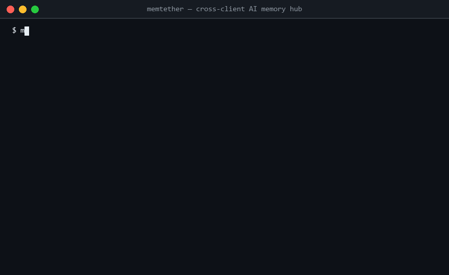

<div align="center">



# MemTether

**你的 AI agents 什么都忘。MemTether 给它们一个共享大脑。**

一份物理 SQLite 数据库，通过文件级指针被所有 AI 客户端共享。
零云端、零 API 费用、零同步进程。可 grep、可 git、永远属于你。

[](https://pypi.org/project/memtether/)
[](https://github.com/MemTether/MemTether/actions)

[**在线试用**](https://huggingface.co/spaces/lanbass/memtether-demo) · [English](README.md)

</div>

---

## 快速开始

```bash
pip install memtether
memtether init    # 创建数据库 + 自动连接所有检测到的 AI 客户端
```

就这样。MemTether 自动检测你机器上的 Claude Code、Cursor、Windsurf、Codex、Gemini CLI 等 23 个客户端，写入 MCP 配置并验证。

---

## 为什么选 MemTether

### 其他记忆系统没有的：纠正不删除

```bash
# 周一：Claude Code 写入
$ memtether remember "部署到 8080 端口" --source claude-code

# 周三：通过 Cursor 纠正
$ memtether correct fact-xxx "部署到 9090 端口" --reason "端口变了"

# 周五：另一个 agent 搜索
$ memtether search "部署 端口" --list
  1. [fact] 部署到 9090 端口 (active)     ← 当前真相
     旧的 "8080" 已被替代，没有删除。
     完整审计链：memtether timeline fact-xxx
```

### 连接你的客户端

```bash
memtether init           # 全部自动
memtether setup claude-code   # 逐个接入
```

**支持 23 个客户端**：Claude Code / Desktop, Cursor, Windsurf, VS Code, Zed, JetBrains, Cline, Roo Code, Kilo Code, Continue, Cody, Amazon Q, Gemini CLI, Neovim, Codex CLI, WorkBuddy (CN + Intl), CodeBuddy, ZCode, DSH, OpenClaw

---

## 安全

- **记忆投毒防御**：OWASP LLM01/02/06（12 条规则）
- **输入验证**：content ≤10K / type 白名单 / source 格式
- **作用域隔离**：shared / private / restricted
- **并发写保护**：Hubguard 文件锁 + 原子替换
- **SQL**：全部参数化

---

## 许可证

[Apache-2.0](LICENSE)
